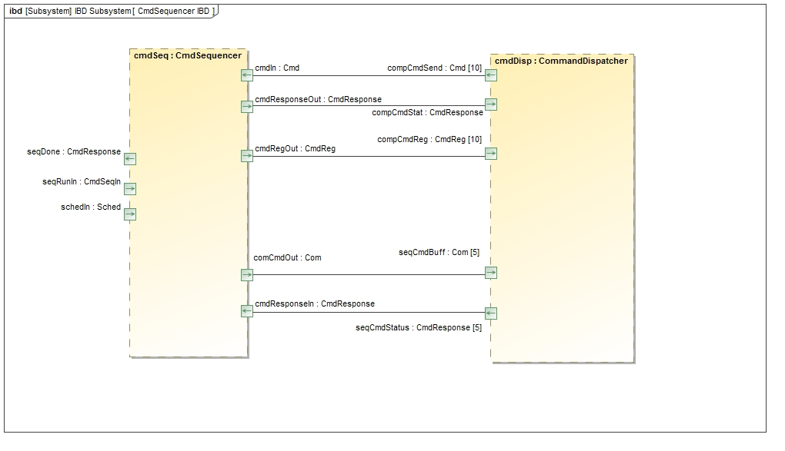
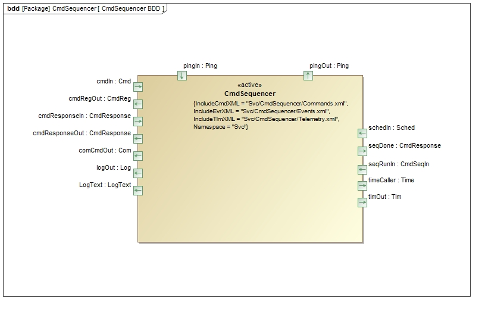
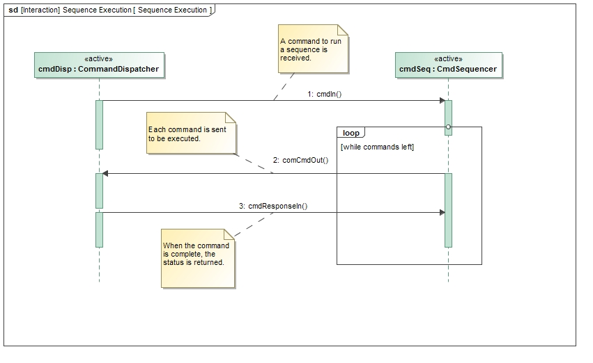

<title>Svc::CmdSequencer Component SDD</title>
# Svc::CmdSequencer Component

### 1.  Introduction

The command sequencer is a component that iterates through a set of commands contained in binary form in a file located in a file system available to the sequencer. A command to the sequencer specifies the file to execute. The file can contain commands that execute immediately, after a delay, or at an absolute time. The sequence will abort if any given command in the sequence returns a failed status.

### 2.  Requirements for `Svc::CmdSequencer` are:

Requirement | Description | Verification Method | Rationale
----------- | ----------- | ------------------- | -------- 
CMDS-001 | The `Svc::CmdSequencer` component shall read sequence files. | Unit Test | CmdSequencer gets commands from the sequence file.
CMDS-002 | The `Svc::CmdSequencer` component shall validate the sequence files with a CRC. | Unit Test | CmdSequencer need to know it has a valid file.
CMDS-003 | The `Svc::CmdSequencer` component shall provide a command to validate the sequence file. | Unit Test | Waiting to validate the file only when running it can cause operational issues
CMDS-004 | The `Svc::CmdSequencer` component shall cancel the sequence upon receiving a failed command status. | Unit Test | A sequence should not continue if a command fails since subsequent commands may depend on the outcome
CMDS-005 | The `Svc::CmdSequencer` component shall provide a command to cancel the existing sequence | Unit Test | Operator should be able to cancel the sequence if it is hung or needs to be stopped. 
CMDS-006 | The `Svc::CmdSequencer` component shall provide an overall sequence timeout. | Unit Test | Sequencer should quit if a component fails to send a command response

### 3  Design
#### 3.1   Component Context 

#### 3.2   Component Interface

#### 3.2.1    Port description table
Port Name|Type|Direction|Usage
---------|----|---------|-----
cmdRegOut|Fw::CmdReg|output|Framework command registration
cmdIn|Fw::Cmd|input|Framework command input port
cmdResponseOut|Fw::CmdResponse|output|Framework command status port
logOut|Fw::Log|output|Framework binary log output port
LogText|Fw::LogText|output|Framework text log output port
tlmOut|Fw::Tlm|output|Framework telemetry port
timeCaller|Fw::Time|output|Framework time port
pingIn|Svc::Ping|async input|Input ping call
pingOut|Svc::Ping|output|Reply for ping
schedIn|Svc::Sched|async input|Scheduler input - timed commands will be checked
comCmdOut|Fw::Com|output|Sends command buffers for each command in sequence
cmdResponseIn|Fw::CmdResponse|asyc input|Received status of last dispatched command
seqRunIn|Svc::CmdSeqIn|async input|Receives requests for running sequences from other components
seqDone|Fw::CmdResponse|output|outputs status of sequence run; meant to be used with `seqRunIn`

#### 3.2.2 Functional description
#### 3.2.2.1 Command Handlers
#### 3.2.2.1.1 CS_Validate
The `CS_Validate` command will validate that the format and checksum of a sequence file are correct without executing any commands in the file. This allows operators to validate a file prior to executing it.
#### 3.2.2.1.2 CS_Run
The `CS_Run` command will exectute a sequence. If a prior sequence is still running, it will be canelled. If a command returns a failed status, the sequence will be aborted.
#### 3.2.2.1.3 CS_Cancel
The `CS_Cancel` command will cancel an existing sequence. If there is no sequence currently executing, the command will emit a warning event but not fail.
#### 3.2.2.1.4 CS_Manual
The `CS_Manual` command will put the sequencer in a manual stepping mode, where the commands will be advanced by the `CS_Step` command. After entering this mode, the operator should issue a `CS_Run` command to load the sequence. In this mode, the sequence will be validated and loaded, but will not execute any commands until receiving the `CS_Start` command
#### 3.2.2.1.5 CS_Start
The `CS_Start` command will execute the first command in the sequence in manual mode.
#### 3.2.2.1.5 CS_Step
The `CS_Step` command will execute subsequent commands after receiving the `CS_Start` command.
#### 3.2.2.1.4 CS_Auto
The `CS_Auto` command will change the sequencing mode from manual to automatic, which means that the sequencer will automatically execute commands upon loading. This command can only be run when there are no currently executing sequences. If a sequence is executing, a `CS_Cancel` followed by a `CS_Auto` will get the sequencer back to executing sequences automatically.
#### 3.2.2.2 Port Handlers
#### 3.2.2.2.1 schedIn
The `schedIn` port checks to see if there is a timed command pending. If the timer for a pending command has expired, the command is dispatched. If there is a command being executed, the command timeout timer is also checked. If it has expired, a warning event is emitted and the sequence is aborted.
#### 3.2.2.2.2 cmdResponseIn
The `cmdResponseIn` port is called when a command in a sequence is completed. If the command status is successful, the next command in the sequence is executed.
#### 3.2.2.2.3 seqRunIn
The `seqRunIn` port is called by other components to request that a sequence be run. It behaves identically to the `CS_Run` command.
#### 3.2.2.2.4 pingIn
The `pingIn` port is called by the `Svc::Health` component to verify that the `CmdSequencer` thread is stll functional. The handler simply takes the provided code and calls the `pingOut` port. 
#### 3.3 Component Structure
Place a Class diagram here to show internal structure of the component
#### 3.3.1    Configuration
#### 3.3.1.1 setTimeout
The `setTimout()` public method sets the command timeout value. When a command is being executed by a component, this value specifies a timeout in seconds that will abort the sequence if execeeded. The default value of zero means that there will be no timeout.
#### 3.3.1.2 allocateBuffer
The `allocateBuffer()` public method passes a memory allocater to provide memory for the sequence buffer needed by `cmdSequencer`. The user will provide an instance of a sub-class of `Fw::MemAllocator` that implements memory allocation. An example of this using the heap can be found in `Fw/Types/MallocAllocator.hpp`.
#### 3.3.1.3 deallocateBuffer
The `deallocateBuffer()` method is used to deallocate the buffer supplied in `allocateBuffer()` method. It should be called before the destructor.
#### 3.3.2    Data formats
#### 3.3.2.1 Sequence File Format

The sequence file consists of a header followed by a set of records. The file is accompanied by a CRC validation file. If a sequence file is to be executed, both need to be present.

The format for the header is as follows. All numbers must be stored in big-endian format.

Header Field | Size (bytes) | Description
------------ | ------------ | -----------
File Size | 4 | Size of command record buffer following header
Number of records | 4 | Number of records in the file
Time Base | 2 | Time Base for sequence (0xFFFF = don't care)
Context | 1 | Context for sequence (project specific) 0xFF = don't care

The format for each record is as follows:

Record Field | Size (bytes) | Description
------------ | ------------ | -----------
Descriptor | 1 | What kind of record it is. 0 = absolute time command, 1 = relative time command, 2 = end of sequence
Command Time | 8 | Start time of command. Depending on descriptor, will be relative or absolute. First four bytes are seconds of command, second four bytes are microseconds of command.
Record Size | 4 | Size of command buffer
Command Buffer | >= 4 | Buffer containing command opcode and arguments. Needs to have at least opcode for commands without arguments.

The last 4 bytes of the file is a CRC of the entire file as computed by Utils/Hash.hpp

#### 3.3.2.2 Sequence File Generator

A utilty is provided that will convert a text file listing of commands and their argument to a binary sequence file.

It can be run by invoking:

`Gse/bin/run_tinyseqgen.sh <input text file>`

The syntax of the file is as follows:

`;` - Comment Character. Any text after this will be ignored. Can be anywhere on a line.

__Relative Time Command:__

`RHH:MM::SS.FFFF MNEMONIC A1,A2...AN`

where:

`R` - Relative time descriptor

`HH` - delay in hours

`MM` - delay in minutes

`SS` - delay in seconds

`.FFFF` - delay in fractions of a second (optional)

`MNEMONIC` - Command mnemonic in dictionary

`A1,A2...AN` - any arguments for the command

__Immediate Command:__

A no delay command is a special case of a relative delay with zero delay specified:

`R00:00:00 MNEMONIC A1,A2...AN`

__Absolute Command:__

`AYYYY-DOYTHH:MM:SS.FFFF MNEMONIC A1,A2...AN`

where:

`R` - Relative time descriptor

`YYYY` - Year

`DOY` - Day of Year

`HH` - delay in hours

`MM` - delay in minutes

`SS` - delay in seconds

`.FFFF` - delay in fractions of a second (optional)

`MNEMONIC` - Command mnemonic in dictionary

`A1,A2...AN` - any arguments for the command

Note that the time is encoded in UTC with an epoch of 1/1/1970.

An example can be seen in [Gse/bin/simple_sequence.seq](../../../Gse/bin/simple_sequence.seq)

#### 3.4   Component State
The `CmdSequencer` does not have any significant state machines.
#### 3.5   Component Dictionary
Dictionaries: [HTML](CmdSequencer.html) [MD](CmdSequencer.md)
#### 3.6    Component Sequences
#### 3.6.1 Component Sequence Execution

### 4  Module Checklists
[Design Checklist](Checklist_Design.xlsx)

[Code Checklist](Checklist_Code.xlsx)

[Unit Test Checklist](Checklist_Unit_Test.xls)

### 5  Unit Testing

[CmdSequencerImpl.cpp](../test/ut/output/CmdSequencerImpl.cpp.gcov)

[CmdSequencerComponentAc.cpp](../test/ut/output/CmdSequencerComponentAc.cpp.gcov)

### 6  Change log
Date | Change Description
---- | ------------------
2/26/2017|Version for Design/Code Review
4/6/2017|Version for Unit test